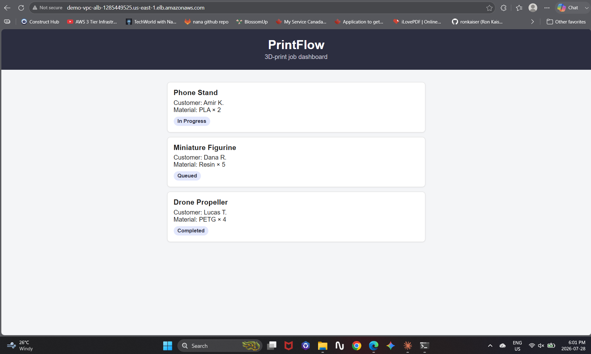

# AWS Multi-AZ 3-Tier Architecture (Terraform).

[](aws_vpc_diagram.png)

A Terraform configuration that provisions a production-style, multi-AZ 3-tier architecture on AWS: a VPC networking foundation (public/private subnets across three Availability Zones, Internet Gateway, NAT Gateway, route tables) plus a compute layer (Auto Scaling Group of EC2 instances behind an Application Load Balancer), all built with infrastructure as code.

Traffic flow: **Internet to Application Load Balancer (public subnets) to Target Group to EC2 instances (private subnets, via Auto Scaling Group)**. Instances are never directly reachable from the internet - only the ALB's security group can reach them, and their outbound traffic (updates, etc.) goes through the NAT Gateway.

## What It Builds

**Networking:**
- 1 VPC (`10.0.0.0/16`)
- 3 public subnets, one per Availability Zone
- 3 private subnets, one per Availability Zone
- 1 Internet Gateway (for public subnet internet access)
- 1 NAT Gateway with an Elastic IP (for private subnet outbound internet access)
- Route tables and associations wiring public subnets to the Internet Gateway and private subnets to the NAT Gateway

**Compute:**
- Security groups: one for the ALB (accepts HTTP from the internet), one for the instances (only accepts traffic from the ALB, never directly from the internet)
- A launch template (latest Amazon Linux 2023 AMI, looked up dynamically) whose user data installs httpd and pulls the real PrintFlow dashboard (index.html, styles.css, script.js) from the web-app-on-digitalocean repo
- An Auto Scaling Group (default: 2 instances, scales 1-3) running in the private subnets
- An Application Load Balancer in the public subnets, with a target group and listener forwarding HTTP traffic to the instances

## Architecture

The diagram above illustrates the general networking pattern - a VPC spanning three Availability Zones, each with a paired public and private subnet, a single NAT Gateway with an Elastic IP, and separate public/private route tables. (Note: the CIDR values shown in the diagram are illustrative placeholders - see the exact ranges used in this project in the table below.) The compute layer sits on top of this: the ALB lives in the public subnets and the Auto Scaling Group's instances live in the private subnets behind it.

All three private subnets route outbound traffic through a single shared NAT Gateway located in the first public subnet.

## Subnet CIDR Breakdown

| Subnet | AZ | CIDR Block | Type |
|---|---|---|---|
| public_subnet_1 | AZ 1 | 10.0.101.0/24 | Public |
| public_subnet_2 | AZ 2 | 10.0.102.0/24 | Public |
| public_subnet_3 | AZ 3 | 10.0.103.0/24 | Public |
| private_subnet_1 | AZ 1 | 10.0.1.0/24 | Private |
| private_subnet_2 | AZ 2 | 10.0.2.0/24 | Private |
| private_subnet_3 | AZ 3 | 10.0.3.0/24 | Private |

Subnet CIDRs are calculated dynamically with Terraform's `cidrsubnet()` function rather than hardcoded, so the ranges scale automatically if the base VPC CIDR changes.

## Project Structure

```
.
├── main.tf        # VPC, subnets, route tables, IGW, NAT Gateway, EIP
├── compute.tf     # Security groups, launch template, Auto Scaling Group, ALB
├── variable.tf    # Input variable declarations
├── output.tf      # Output values
├── terraform.tf   # Terraform version and provider requirements
```

## Requirements

| Name | Version |
|---|---|
| Terraform | >= 1.0.0 |
| AWS Provider | >= 6.31.0 |
| AWS Account | Active, with credentials configured locally (e.g. via `aws configure`) |

## Usage

```bash
# Initialize Terraform and download the AWS provider
terraform init

# Preview the resources that will be created
terraform plan

# Provision the infrastructure
terraform apply

# Tear everything down when finished
terraform destroy
```

After `apply` finishes, open the `alb_dns_name` output value in a browser - it takes a few minutes for the Auto Scaling Group's instances to pass the load balancer's health check the first time.

## Verified Working

Tested end-to-end on July 28, 2026: ran `terraform apply` (25 resources created), confirmed the `alb_dns_name` output served the real PrintFlow dashboard end-to-end (internet -> ALB -> target group -> EC2 instance -> PrintFlow, pulled live from the `web-app-on-digitalocean` repo), then ran `terraform destroy` to tear the stack back down cleanly.



## Outputs

| Output | Description |
|---|---|
| `vpc_id` | The ID of the created VPC |
| `alb_dns_name` | Public DNS name of the Application Load Balancer |

## Possible Improvements

- Single NAT Gateway: all private subnets currently share one NAT Gateway for simplicity and cost. A production setup would typically use one NAT Gateway per AZ for high availability.
- Unused `aws_region` variable: the variable is declared but the provider block currently hardcodes `us-east-1` directly rather than referencing it.
- HTTP only: the ALB listener is currently HTTP on port 80, not HTTPS - a real production setup would add an ACM certificate and an HTTPS listener.
- No autoscaling policies yet: the Auto Scaling Group has fixed min/max/desired sizing rather than scaling on a CloudWatch metric (e.g. CPU utilization).
- Limited outputs: subnet IDs, security group IDs, and the NAT Gateway ID would be useful additions for downstream modules.
- user_data fetches PrintFlow at boot only: instances already running won't pick up changes to the PrintFlow files automatically - only newly launched instances will.

## Author

Shahtaj Singh Gill
[LinkedIn](https://www.linkedin.com/in/shahtaj-toronto-gta/) · [GitHub](https://github.com/shahtaj2102)
  
