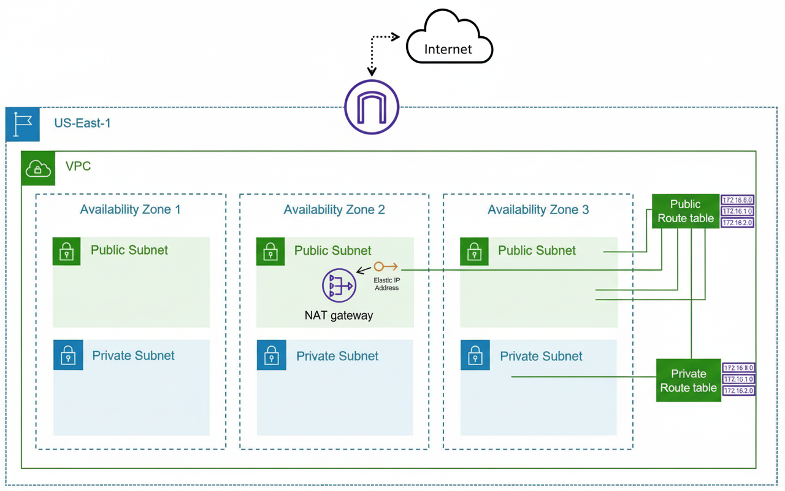

# AWS-Terraform-Project

[](aws_vpc_diagram.png)

## 🎯 Project Overview

This Terraform project deploys a **production-ready AWS VPC** with public and private subnets across multiple Availability Zones, complete with Internet Gateway for public access and NAT Gateway for secure private outbound connectivity. Perfect for your first AWS infrastructure project!

**Key Features:**
- 3-tier VPC architecture (10.0.0.0/16)
- 3 Public subnets (direct internet access)
- 3 Private subnets (NAT Gateway outbound only)
- High availability across 3 AZs
- Auto-assigned public IPs on public subnets
- Secure routing with dedicated route tables

## 🏗️ Architecture Diagram


**What gets created:**
```
VPC: demo_vpc (10.0.0.0/16)
├── Public Subnets (3 AZs): 10.0.x.0/24 → Internet Gateway
├── Private Subnets (3 AZs): 10.0.y.0/24 → NAT Gateway  
├── Internet Gateway (IGW)
├── NAT Gateway + Elastic IP (public_subnet_1)
├── Public Route Table (0.0.0.0/0 → IGW)
└── Private Route Table (0.0.0.0/0 → NAT)
```

## 📁 Project Structure
```
First-AWS-Project/
├── main.tf              # Core infrastructure
├── variables.tf         # Configurable parameters
├── outputs.tf           # Queryable resource IDs
├── terraform.tfvars     # Environment overrides
├── aws_vpc_diagram.png  # Architecture visualization
└── README.md           # You're reading it!
```


## 🚀 Quick Start

1. **Prerequisites**
   
   Install Terraform

   AWS CLI configured with credentials

   aws configure

2. **Deploy**
```
   terraform init

   terraform validate

   terraform plan

   terraform apply
```
3. **access resources**

   terraform output vpc_id
   
   terraform output public_subnet_ids

 4.**Cleanup**
 ```
terraform destroy
```

## 🔧 Configuration

| Variable          | Default          | Description            |
|-------------------|------------------|------------------------|
| `aws_region`      | `us-east-1`      | AWS deployment region  |
| `vpc_name`        | `demo_vpc`       | VPC display name       |
| `vpc_cidr`        | `10.0.0.0/16`    | VPC IP range           |
| `private_subnets` | `{0,1,2}`        | AZ index mapping       |


## 🛠️ Resources Created

| Resource                      | Count | Purpose                    |
|-------------------------------|-------|----------------------------|
| `aws_vpc`                     | 1     | Main networking container  |
| `aws_subnet.public`           | 3     | Internet-facing workloads  |
| `aws_subnet.private`          | 3     | Database/EC2 (secure)      |
| `aws_internet_gateway`        | 1     | Public internet access     |
| `aws_eip`                     | 1     | NAT Gateway static IP      |
| `aws_nat_gateway`             | 1     | Private subnet outbound    |
| `aws_route_table`             | 2     | Public/private routing     |
| `aws_route_table_association` | 6     | Subnet-route table links   |


## 🔍 CIDR Breakdown

VPC: 10.0.0.0/16 (65,536 IPs)
```
├── Public Subnets:
│   ├── AZ1: 10.0.1.0/24 (256 IPs)
│   ├── AZ2: 10.0.2.0/24 (256 IPs)  
│   └── AZ3: 10.0.101.0/24 (256 IPs)
└── Private Subnets:
    ├── AZ1: 10.0.1.0/24 (256 IPs)
    ├── AZ2: 10.0.2.0/24 (256 IPs)
    └── AZ3: 10.0.3.0/24 (256 IPs)
```

## 🏆 Learning Outcomes

✅ VPC networking fundamentals

✅ Public/private subnet isolation

✅ High availability with multiple AZs

✅ NAT Gateway for secure outbound

✅ Terraform for_each patterns

✅ cidrsubnet() function mastery

✅ Route table associations

## 📄 License

MIT License - See [LICENSE](LICENSE) for details.

## 👨‍💻 Author

**Shahtaj** - Aspiring Cloud/DevOps Engineer (AWS SAP Certified)  
[](https://www.linkedin.com/in/shahtaj-singh-gill/) [](https://github.com/shahtaj2102)

---

⭐ **Star this repo if it helped your AWS journey!** ⭐


